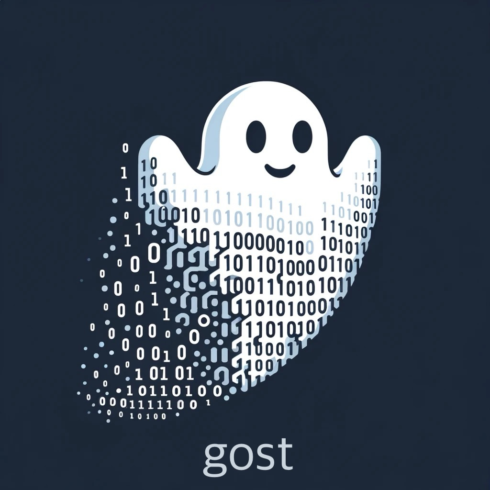

# [A2Y-D5L](https://github.com/a2y-d5l) / gost

What if starting a new go project were as simple as `$ go start rest-service`, `$ go start cli`, or `$ go start library`? If you're like me, then you're probably thinking:

> That would be great if there was a tool that didn't impose horribly opinionated takes on application design.

And that's why I'm creating `gost`, a tool to streamline start time for new projects that are idiomatic and standardized (whatever that means to you). Extensibility is *the* core principle in the design of `gost`. importantly, to streamline the authoring, managing, exploring, and publishing of the standards themselves.

### Built on Go's Foundations

At its heart, `gost` leverages the `text/template` package from Go's standard library, infusing it with additional capabilities specifically aimed at Go developers. It enriches the foundational text generation provided by `text/template`, allowing for intricate Go expressions to be dynamically integrated within templates. This includes support for variable insertion, conditional logic, iteration, and the incorporation of custom functions, presented through a familiar Go-centric syntax.

`gost` introduces a CLI for straightforward template management, enriches the syntax for better alignment with Go idioms, and establishes a communal platform for the sharing of templates. Essentially, it's `text/template` enhanced with tools and features that resonate with the daily workflows of Go developers, making it an indispensable asset for generating Go modules more efficiently.

### Standardization Use Cases

One of the paramount goals of `gost` is to foster standardization within engineering organizations. It aims to serve as a pivotal tool for teams to craft reproducible solutions that adhere to company or organization-specific standards. Here's how `gost` contributes to standardization:

- **Consistent Project Structures**: `gost` templates can define a standardized project layout, ensuring that all projects within an organization start with a consistent file and directory structure, naming conventions, and basic setup. This consistency simplifies onboarding for new developers and streamlines the maintenance process.
  
- **Enforcing Coding Practices**: Templates can include boilerplate code that follows best practices and coding standards specific to the organization. This ensures that every new project automatically adheres to these standards, reducing the need for extensive code reviews focused on style and convention compliance.

- **Reusable Components**: `gost` allows teams to create templates for commonly used components or modules within their organization. This facilitates the reuse of code that has been vetted and approved, reducing duplication of effort and ensuring that solutions are built on proven, reliable foundations.

- **Custom Functionality for Organization Needs**: Through the integration of custom functions within templates, `gost` enables organizations to encapsulate complex logic or domain-specific functionality that can be easily reused across projects. This feature supports the creation of templates that not only scaffold a project but also imbue it with the organization's unique business logic or infrastructure setup.

- **Shared Template Repositories**: `gost` supports the concept of template repositories, enabling organizations to maintain a centralized collection of templates. This repository acts as a single source of truth for project setups, ensuring that every team within the organization has access to the latest, approved project templates.

In essence, `gost` is not just a tool for generating Go code—it's a framework for embedding and disseminating organizational knowledge and standards. By leveraging `gost`, engineering organizations can ensure that every new project is not just a fresh start, but a continuation of a tradition of excellence, efficiency, and standardization.
